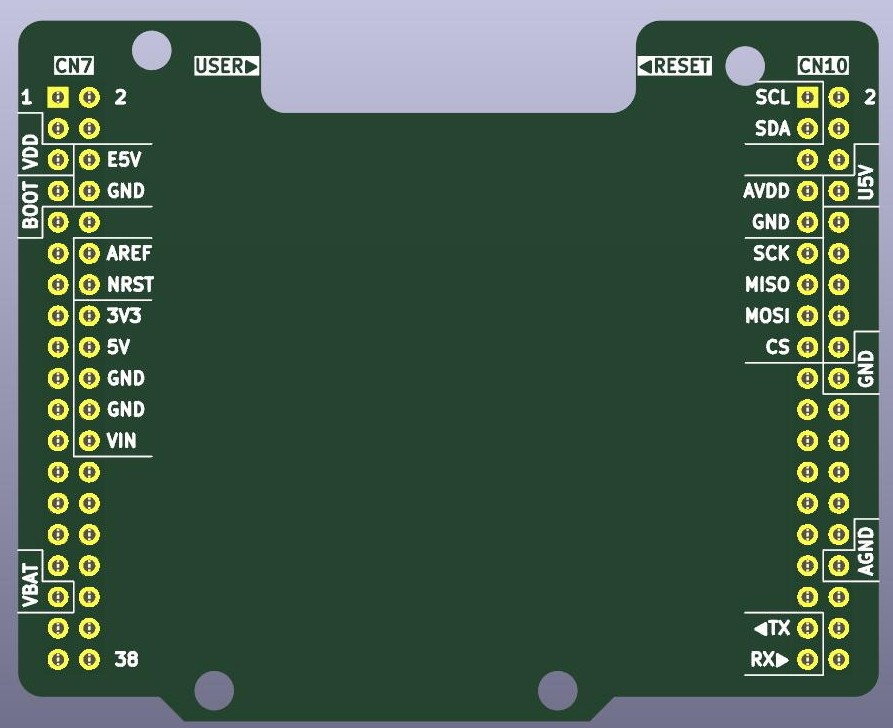
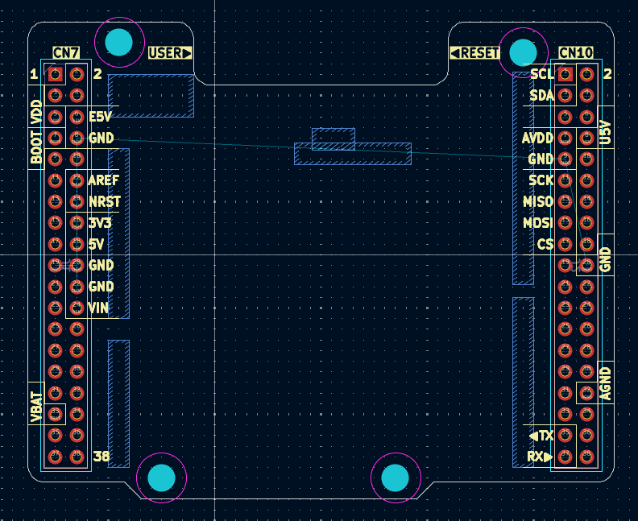

# Nucleo64 shield template

This repository is a template for shields to be used with Nucleo64 development boards and fitting on their Morpho connectors.

## Difference from KiCAD-native template

KiCAD 9 has already built-in template for a similar shield, but I needed some other features:

- keep access to the user and reset buttons on the Nucleo64 boards
- additional keep-out zones for areas, where
	- various Nucleo64 boards have pin headers for power consumption measurement or power selection
	- where placing components on the bottom shield may smash into Arduino headers
- extra hole to the bottom-left header (like on Arduino Uno R3) 
- fit the cutout dimentions main MCU part of Nucleo64 boards with detachable STLink
- silkscreen labels for default SPI / I²C / Serial pins on headers

## Render

| Top View  | Board Layout |
| ------------- | ------------- |
|   |   |

## Remarks

Measurements are based on the MB1319B (STM32 Nucleo-64-P boards).